# 📡 Documentação de Integração Laravel

## 🎯 Visão Geral

Esta documentação descreve os endpoints que seu sistema Laravel deve implementar para integração com o sistema de controle de catraca Academia Orion.

### Arquitetura de Comunicação

```
[Sistema C# - Academia]
      ↓ (Pull) Busca comandos a cada 5s
      ↓ (Push) Envia eventos de entrada/saída
[Laravel - Hospedagem Compartilhada]
      ↓ Processa e armazena no banco
[Banco de Dados MySQL]
```

## 🔐 Autenticação

Todas as requisições incluem o header:
```
X-API-Key: sua-api-key-secreta
```

Verifique este header em um middleware Laravel:

```php
// app/Http/Middleware/TurnstileApiAuth.php
public function handle($request, Closure $next)
{
    $apiKey = $request->header('X-API-Key');
    
    if ($apiKey !== config('turnstile.api_key')) {
        return response()->json(['error' => 'Unauthorized'], 401);
    }
    
    return $next($request);
}
```

---

## 📋 Endpoints Necessários

### 1. **Ping - Teste de Conexão**

**Método:** `GET`  
**URL:** `/api/turnstile/ping`  
**Descrição:** Verifica se o sistema Laravel está respondendo

**Resposta (200 OK):**
```json
{
    "status": "ok",
    "timestamp": "2024-12-16T15:30:00Z",
    "version": "1.0"
}
```

**Implementação Laravel:**
```php
// routes/api.php
Route::get('/turnstile/ping', [TurnstileController::class, 'ping']);

// app/Http/Controllers/TurnstileController.php
public function ping()
{
    return response()->json([
        'status' => 'ok',
        'timestamp' => now()->toIso8601String(),
        'version' => '1.0'
    ]);
}
```

---

### 2. **Comandos Pendentes**

**Método:** `GET`  
**URL:** `/api/turnstile/commands/pending`  
**Descrição:** Lista comandos que o sistema C# deve executar

**Resposta (200 OK):**
```json
[
    {
        "id": 1,
        "type": "add_user",
        "data": "{\"id\":123,\"name\":\"João Silva\",\"cardNumber\":\"123456\",\"password\":\"1234\",\"active\":true}",
        "created_at": "2024-12-16T15:00:00Z"
    },
    {
        "id": 2,
        "type": "register_biometry",
        "data": "{\"userId\":123}",
        "created_at": "2024-12-16T15:05:00Z"
    }
]
```

**Tipos de Comando:**
- `add_user` - Adicionar usuário na catraca
- `remove_user` - Remover usuário da catraca
- `block_user` - Bloquear acesso do usuário
- `unblock_user` - Desbloquear acesso do usuário
- `register_biometry` - Iniciar cadastro de biometria
- `delete_biometry` - Excluir biometria do usuário

**Implementação Laravel:**
```php
// Model
class TurnstileCommand extends Model
{
    protected $fillable = ['type', 'data', 'status'];
}

// Controller
public function pendingCommands()
{
    $commands = TurnstileCommand::where('status', 'pending')
        ->orderBy('created_at', 'asc')
        ->get();
        
    return response()->json($commands);
}
```

---

### 3. **Confirmar Execução de Comando**

**Método:** `POST`  
**URL:** `/api/turnstile/commands/{id}/confirm`  
**Descrição:** Sistema C# confirma que executou o comando

**Corpo da Requisição:**
```json
{
    "success": true,
    "message": "Usuário adicionado com sucesso"
}
```

**Resposta (200 OK):**
```json
{
    "success": true,
    "message": "Comando confirmado"
}
```

**Implementação Laravel:**
```php
public function confirmCommand(Request $request, $id)
{
    $command = TurnstileCommand::findOrFail($id);
    
    $command->update([
        'status' => $request->success ? 'completed' : 'failed',
        'result_message' => $request->message,
        'completed_at' => now()
    ]);
    
    return response()->json([
        'success' => true,
        'message' => 'Comando confirmado'
    ]);
}
```

---

### 4. **Receber Eventos da Catraca**

**Método:** `POST`  
**URL:** `/api/turnstile/events`  
**Descrição:** Recebe eventos de entrada/saída da catraca

**Corpo da Requisição:**
```json
{
    "event_type": "entry",
    "user_id": 123,
    "user_name": "João Silva",
    "card_number": "123456",
    "direction": "entry",
    "timestamp": "2024-12-16T15:30:45",
    "success": true,
    "reason": ""
}
```

**Campos:**
- `event_type`: `entry` | `exit` | `denied` | `error`
- `user_id`: ID do usuário no sistema (null se não identificado)
- `user_name`: Nome do usuário
- `card_number`: Número do cartão usado
- `direction`: `entry` | `exit`
- `timestamp`: Data/hora do evento
- `success`: `true` (passou) | `false` (negado)
- `reason`: Motivo se acesso negado

**Resposta (200 OK):**
```json
{
    "success": true,
    "event_id": 456
}
```

**Implementação Laravel:**
```php
// Model
class TurnstileEvent extends Model
{
    protected $fillable = [
        'event_type', 'user_id', 'user_name', 'card_number',
        'direction', 'timestamp', 'success', 'reason'
    ];
    
    protected $casts = [
        'timestamp' => 'datetime',
        'success' => 'boolean'
    ];
}

// Controller
public function handleEvent(Request $request)
{
    $request->validate([
        'event_type' => 'required|in:entry,exit,denied,error',
        'direction' => 'required|in:entry,exit',
        'timestamp' => 'required|date',
        'success' => 'required|boolean'
    ]);
    
    $event = TurnstileEvent::create($request->all());
    
    // Opcional: Notificar Gympass se for check-in
    if ($request->success && $request->direction === 'entry' && $request->user_id) {
        $user = User::find($request->user_id);
        if ($user && $user->is_gympass) {
            GympassService::notifyCheckIn($user);
        }
    }
    
    return response()->json([
        'success' => true,
        'event_id' => $event->id
    ]);
}
```

---

### 5. **Usuários Pendentes de Sincronização**

**Método:** `GET`  
**URL:** `/api/turnstile/users/pending-sync`  
**Descrição:** Lista usuários que precisam ser sincronizados com a catraca

**Resposta (200 OK):**
```json
[
    {
        "id": 123,
        "name": "João Silva",
        "card_number": "123456",
        "password": "1234",
        "active": true,
        "expires_at": "2025-12-31T23:59:59Z",
        "has_biometry": true,
        "biometry_data": "base64encodedstring..."
    }
]
```

**Implementação Laravel:**
```php
public function pendingSyncUsers()
{
    $users = User::where('sync_status', 'pending')
        ->orWhere('updated_at', '>', Carbon::now()->subMinutes(5))
        ->get()
        ->map(function($user) {
            return [
                'id' => $user->id,
                'name' => $user->name,
                'card_number' => $user->card_number,
                'password' => $user->turnstile_password,
                'active' => $user->active,
                'expires_at' => $user->expires_at,
                'has_biometry' => $user->biometry()->exists(),
                'biometry_data' => $user->biometry?->data_base64
            ];
        });
    
    return response()->json($users);
}
```

---

### 6. **Confirmar Sincronização de Usuário**

**Método:** `POST`  
**URL:** `/api/turnstile/users/{id}/synced`  
**Descrição:** Confirma que usuário foi sincronizado com a catraca

**Corpo da Requisição:**
```json
{
    "success": true
}
```

**Resposta (200 OK):**
```json
{
    "success": true,
    "message": "Usuário sincronizado"
}
```

**Implementação Laravel:**
```php
public function confirmUserSync(Request $request, $id)
{
    $user = User::findOrFail($id);
    
    $user->update([
        'sync_status' => $request->success ? 'synced' : 'error',
        'last_sync_at' => now()
    ]);
    
    return response()->json([
        'success' => true,
        'message' => 'Usuário sincronizado'
    ]);
}
```

---

## 🗄️ Estrutura de Banco de Dados Sugerida

### Tabela: `turnstile_commands`
```sql
CREATE TABLE turnstile_commands (
    id BIGINT UNSIGNED AUTO_INCREMENT PRIMARY KEY,
    type VARCHAR(50) NOT NULL,
    data TEXT NOT NULL,
    status ENUM('pending', 'completed', 'failed') DEFAULT 'pending',
    result_message TEXT NULL,
    completed_at TIMESTAMP NULL,
    created_at TIMESTAMP DEFAULT CURRENT_TIMESTAMP,
    updated_at TIMESTAMP DEFAULT CURRENT_TIMESTAMP ON UPDATE CURRENT_TIMESTAMP,
    INDEX idx_status (status),
    INDEX idx_created (created_at)
);
```

### Tabela: `turnstile_events`
```sql
CREATE TABLE turnstile_events (
    id BIGINT UNSIGNED AUTO_INCREMENT PRIMARY KEY,
    event_type ENUM('entry', 'exit', 'denied', 'error') NOT NULL,
    user_id BIGINT UNSIGNED NULL,
    user_name VARCHAR(255) NULL,
    card_number VARCHAR(50) NULL,
    direction ENUM('entry', 'exit') NOT NULL,
    timestamp TIMESTAMP NOT NULL,
    success BOOLEAN NOT NULL,
    reason TEXT NULL,
    created_at TIMESTAMP DEFAULT CURRENT_TIMESTAMP,
    INDEX idx_user (user_id),
    INDEX idx_timestamp (timestamp),
    INDEX idx_event_type (event_type),
    FOREIGN KEY (user_id) REFERENCES users(id) ON DELETE SET NULL
);
```

### Adicionar campos na tabela `users`
```sql
ALTER TABLE users ADD COLUMN card_number VARCHAR(50) NULL;
ALTER TABLE users ADD COLUMN turnstile_password VARCHAR(20) NULL;
ALTER TABLE users ADD COLUMN sync_status ENUM('pending', 'synced', 'error') DEFAULT 'pending';
ALTER TABLE users ADD COLUMN last_sync_at TIMESTAMP NULL;
ALTER TABLE users ADD COLUMN is_gympass BOOLEAN DEFAULT FALSE;
ALTER TABLE users ADD COLUMN gympass_external_id VARCHAR(100) NULL;
```

---

## 🔄 Fluxo Completo de Integração

### **1. Cadastro de Novo Aluno**

```mermaid
sequenceDiagram
    Admin->>Laravel: Cadastra aluno
    Laravel->>DB: INSERT INTO users
    Laravel->>DB: INSERT INTO turnstile_commands (type: add_user)
    Sistema C#->>Laravel: GET /api/turnstile/commands/pending
    Laravel-->>Sistema C#: [comando add_user]
    Sistema C#->>Catraca: Adiciona usuário
    Sistema C#->>Laravel: POST /api/turnstile/commands/1/confirm
```



### **2. Entrada do Aluno**

```mermaid
sequenceDiagram
    Aluno->>Catraca: Passa cartão/biometria
    Catraca->>Sistema C#: Acesso autorizado
    Sistema C#->>Laravel: POST /api/turnstile/events (type: entry)
    Laravel->>DB: INSERT INTO turnstile_events
    Laravel->>Gympass: Notifica check-in (se Gympass)
```



---

## 🧪 Testando a Integração

### 1. Teste de Conexão (Ping)
```bash
curl -X GET https://academiaorion.com.br/api/turnstile/ping \
  -H "X-API-Key: sua-api-key-secreta"
```

### 2. Criar Comando de Teste
```php
TurnstileCommand::create([
    'type' => 'add_user',
    'data' => json_encode([
        'id' => 1,
        'name' => 'Teste Silva',
        'cardNumber' => '999999',
        'password' => '1234',
        'active' => true
    ])
]);
```

### 3. Simular Evento de Entrada
```bash
curl -X POST https://academiaorion.com.br/api/turnstile/events \
  -H "X-API-Key: sua-api-key-secreta" \
  -H "Content-Type: application/json" \
  -d '{
    "event_type": "entry",
    "user_id": 1,
    "user_name": "Teste Silva",
    "card_number": "999999",
    "direction": "entry",
    "timestamp": "2024-12-16T15:30:00",
    "success": true,
    "reason": ""
  }'
```

---

## ⚙️ Configuração no Sistema C#

No painel "Integração Laravel":

1. **URL Base:** `https://academiaorion.com.br`
2. **API Key:** `sua-api-key-secreta-aqui`
3. **Intervalo:** `5` segundos
4. **Timeout:** `30` segundos

Clique em "Testar Conexão" para validar.

---

## 📊 Endpoints de Relatório (Opcional)

Você pode criar endpoints adicionais para dashboards:

### Estatísticas do Dia
```php
Route::get('/turnstile/stats/today', function() {
    return [
        'total_entries' => TurnstileEvent::whereDate('timestamp', today())
            ->where('direction', 'entry')->where('success', true)->count(),
        'denied_entries' => TurnstileEvent::whereDate('timestamp', today())
            ->where('direction', 'entry')->where('success', false)->count(),
        'current_inside' => // Lógica para calcular quem está dentro
    ];
});
```

---

## 🎓 Exemplo Completo de Controller Laravel

```php
<?php

namespace App\Http\Controllers;

use App\Models\TurnstileCommand;
use App\Models\TurnstileEvent;
use App\Models\User;
use Illuminate\Http\Request;
use Carbon\Carbon;

class TurnstileController extends Controller
{
    public function __construct()
    {
        $this->middleware('turnstile.auth');
    }

    public function ping()
    {
        return response()->json([
            'status' => 'ok',
            'timestamp' => now()->toIso8601String(),
            'version' => '1.0'
        ]);
    }

    public function pendingCommands()
    {
        $commands = TurnstileCommand::where('status', 'pending')
            ->orderBy('created_at', 'asc')
            ->get();
            
        return response()->json($commands);
    }

    public function confirmCommand(Request $request, $id)
    {
        $command = TurnstileCommand::findOrFail($id);
        
        $command->update([
            'status' => $request->success ? 'completed' : 'failed',
            'result_message' => $request->message,
            'completed_at' => now()
        ]);
        
        return response()->json([
            'success' => true,
            'message' => 'Comando confirmado'
        ]);
    }

    public function handleEvent(Request $request)
    {
        $request->validate([
            'event_type' => 'required|in:entry,exit,denied,error',
            'direction' => 'required|in:entry,exit',
            'timestamp' => 'required|date',
            'success' => 'required|boolean'
        ]);
        
        $event = TurnstileEvent::create($request->all());
        
        return response()->json([
            'success' => true,
            'event_id' => $event->id
        ]);
    }

    public function pendingSyncUsers()
    {
        $users = User::where('sync_status', 'pending')
            ->orWhere('updated_at', '>', Carbon::now()->subMinutes(5))
            ->get()
            ->map(function($user) {
                return [
                    'id' => $user->id,
                    'name' => $user->name,
                    'card_number' => $user->card_number,
                    'password' => $user->turnstile_password,
                    'active' => $user->active,
                    'expires_at' => $user->expires_at,
                    'has_biometry' => $user->biometry()->exists(),
                    'biometry_data' => $user->biometry?->data_base64
                ];
            });
        
        return response()->json($users);
    }

    public function confirmUserSync(Request $request, $id)
    {
        $user = User::findOrFail($id);
        
        $user->update([
            'sync_status' => $request->success ? 'synced' : 'error',
            'last_sync_at' => now()
        ]);
        
        return response()->json([
            'success' => true,
            'message' => 'Usuário sincronizado'
        ]);
    }
}
```

---

## 🔒 Segurança

1. **Use HTTPS:** Sempre em produção
2. **API Key forte:** Gere com `Str::random(64)`
3. **Rate Limiting:** Limite requisições por minuto
4. **Logs:** Registre todas as operações
5. **Validação:** Valide todos os inputs
6. **CORS:** Configure corretamente se necessário

---

## 📞 Suporte

Em caso de dúvidas, verifique:
- Logs do sistema C# (aba "Logs do Sistema")
- Status da integração (aba "Integração Laravel")
- Console do navegador (F12)

---

**Versão:** 1.0  
**Data:** Dezembro 2024  
**Sistema:** Academia Orion Turnstile Control
