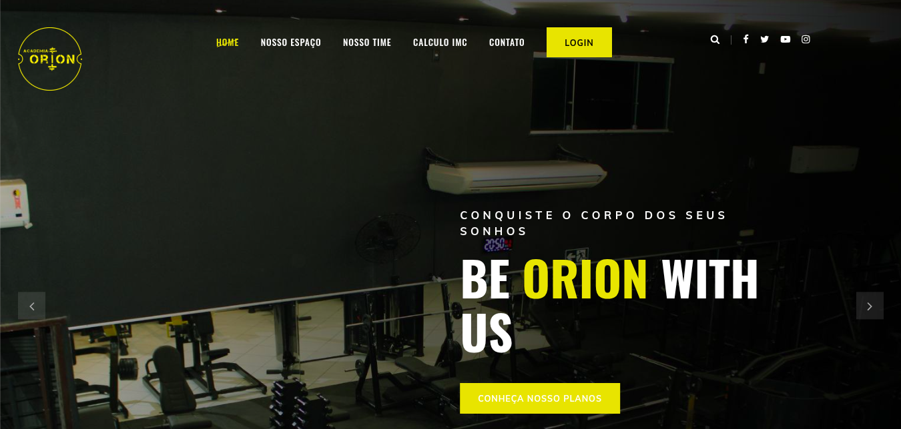
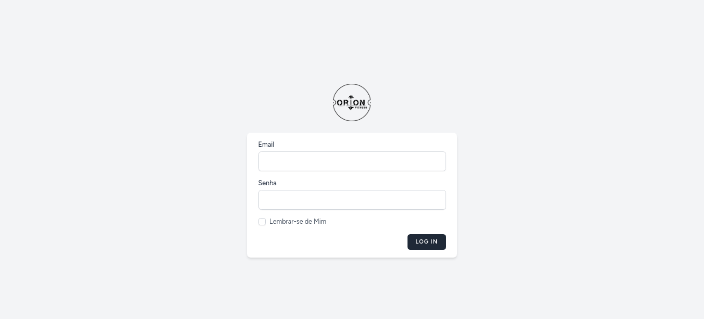
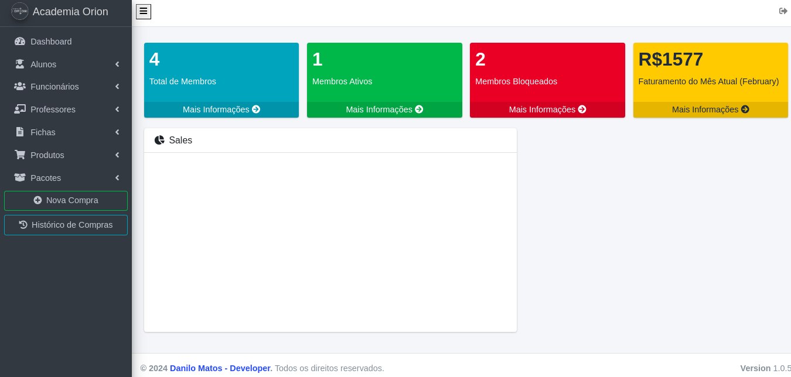

# Laravel_OrionGym


## Project Description

**Laravel_OrionGym** is a web application designed to assist in the comprehensive management of gyms. The platform offers functionalities such as member access control, product and service management, and monitoring of activities and payments.

The system includes a **landing page** that serves as the main interface for users, providing an intuitive and user-friendly experience.




Additionally, the system features a **login mechanism**, allowing users to authenticate and access the application securely.


## Table of Contents

- [Features](#features)
- [Application Demo](#application-demo)
- [Prerequisites](#prerequisites)
- [Installation](#installation)
- [Usage](#usage)
- [Technologies Used](#technologies-used)
- [Contributing](#contributing)
- [Author](#author)
- [License](#license)

## Features

- Landing page interface for user interaction.
- Login system for secure authentication.
- Management of members, including registration, editing, and deletion.
- Access control with logging of entries and exits.
- Management of products and services offered by the gym.
- Monitoring of payments and memberships.
- Detailed reports on activities and finances.

## Application Demo





## Prerequisites

Before starting, ensure you have the following tools installed on your machine:

- [Git](https://git-scm.com/)
- [PHP](https://www.php.net/) (version 7.4 or higher)
- [Composer](https://getcomposer.org/)
- [Node.js](https://nodejs.org/) with npm
- A compatible database server (e.g., MySQL)

## Installation

Follow the steps below to set up the development environment:

1. **Clone the repository:**

   ```bash
   git clone https://github.com/DanMO23/Laravel_OrionGym.git
   cd Laravel_OrionGym
   cd OrionGym
   ```

2. **Install Composer dependencies:**

   ```bash
   composer install
   ```

3. **Configure the environment file:**

   ```bash
   cp .env.example .env
   ```

   Then, open the `.env` file and configure the environment variables, especially the database settings.

4. **Generate the application key:**

   ```bash
   php artisan key:generate
   ```

5. **Run migrations and seeders:**

   ```bash
   php artisan migrate --seed
   ```

6. **Create roles:**

   ```bash
   php artisan create:roles
   ```

7. **Install NPM dependencies (if applicable):**

   ```bash
   npm install
   npm run dev
   ```

## Usage

After completing the installation, start the development server:

```bash
php artisan serve
```

The application will be available at `http://localhost:8000`.

### Creating a User

To create a new user, run the following command:

```bash
php artisan create:user {name} {email} {password}
```


## Technologies Used

- [Laravel](https://laravel.com/)
- [Laravel Orion](https://orion.tailflow.org/)
- [PHP](https://www.php.net/)
- [MySQL](https://www.mysql.com/)
- [Node.js](https://nodejs.org/)
- [npm](https://www.npmjs.com/)
- [Tailwind CSS](https://tailwindcss.com/)


## Contributing

Contributions are welcome! Feel free to open issues and submit pull requests.

## Author

Developed by [DanMO23](https://github.com/DanMO23).

## License

This project is licensed under the MIT License. See the [LICENSE](LICENSE) file for more information.
